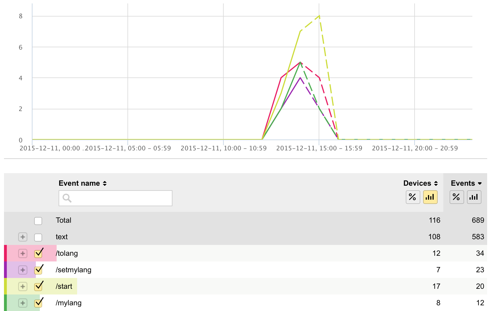
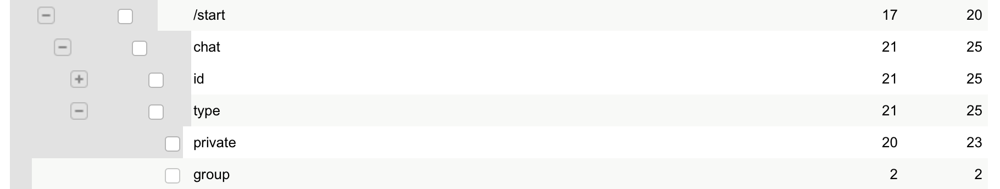
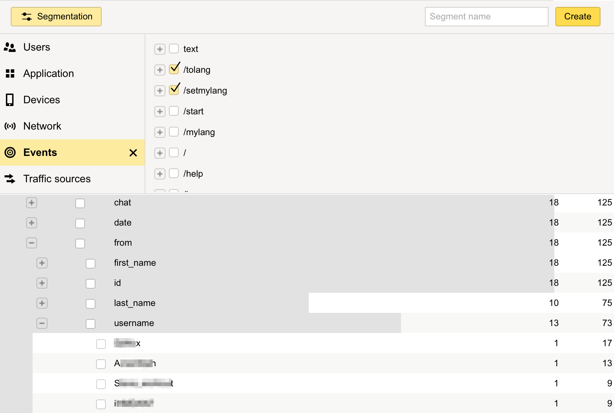
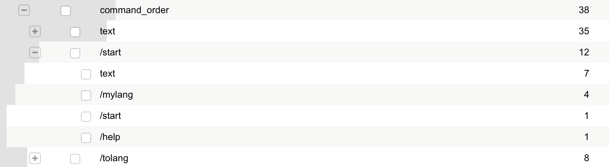
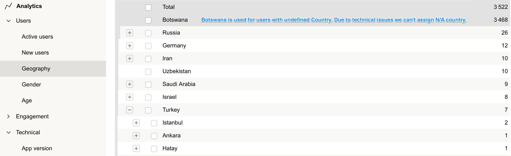
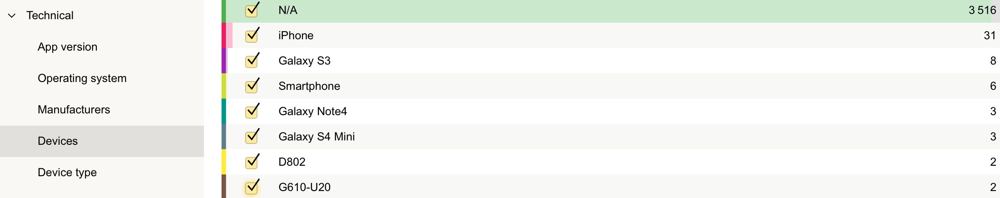
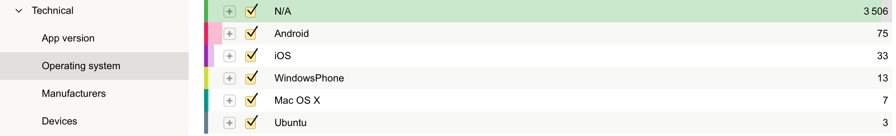
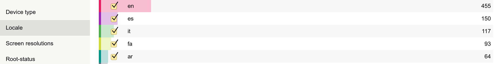

#Botan SDK

[Botan](http://botan.io) is a telegram bot analytics system based on [Yandex.Appmetrica](http://appmetrica.yandex.com/).
In this document you can find how to setup Yandex.Appmetrica account, as well as examples of Botan SDK usage.

Botan has 2 main use cases:
 * [Send to Botan info about every message sent by user](#tracking_data) and get basic usage stats like DAU, MAU, Retention, Commands and more complicated details.
 * [Get extended information about users by wrapping links you send to them](#url-shortening) — location, languages, devices and operating systems of your users.

## Creating an account
 * Go to Botaniobot https://telegram.me/botaniobot?start=src%3Dgithub
 * Use Add bot command to get a token.
 * Download lib for your language, and use it as described below. Don`t forget to insert your token!
 * Come back to Botaniobot https://telegram.me/botaniobot?start=src%3Dgithub and use Statistics command to see your stats.

## SDK usage
We have libraries for the following languages:
 * [Go](#go)
 * [Java](#java)
 * [JavaScript](#js)
 * [PHP](#php)
 * [Python](#py)
 * [Ruby](#ruby)
 * [Rust](#rust)
 * [.Net](#dotnet)

Alternatively, you can use Botan API via [plain HTTP calls](#http).

In case your preferred language is missed, you can make a contribution. It's easy — library usually contains 30 lines of code.

Also, pay attention to ["what data to put into tracking data"](#tracking_data) section.
90% benefit from analytics usage lies in right integration;)

## <a name="js"></a>JavaScript example
Install npm: `npm install botanio`
```js
var botan = require('botanio')(token);

botan.track(message, 'Start');

var uid = message.from.id;
var url = 'https://github.com/'; // some url you want to send to user
botan.shortenUrl(uid, url, function (err, res, body) {
  if (err) {
    console.error(err);
  } else {
    console.log(body); // shortened url here
  }
});
```

## <a name="py"></a>Python example
You need to install requests library to use python botan lib.
You can do it with

	pip install requests

Code:
```python
	import botan

	botan_token = '.........' # Token got from @botaniobot
	uid = message.from_user
	message_dict = message.to_dict()
	event_name = update.message.text
	print botan.track(botan_token, uid, message_dict, event_name)

	.....

	original_url = ... # some url you want to send to user
	short_url = botan.shorten_url(original_url, botan_token, uid)
	# now send short_url to user instead of original_url, and get geography, OS, Device of user
```

## <a name="php"></a>PHP example
You need to put the class in a convenient place.
```php
private $token = 'token';

public function _incomingMessage($message_json) {
    $messageObj = json_decode($message_json, true);
    $messageData = $messageObj['message'];

    $botan = new Botan($this->token);
    $botan->track($messageData, 'Start');

    ...

    $original_url = ...
    $uid = $message['from']['id']
    $short_url = $botan->shortenUrl($url, $uid)
    // now send short_url to user instead of original_url, and get geography, OS, Device of user
}


```

## <a name="ruby"></a>Ruby example
`uid` is a user id you get from Telegram.

	require_relative 'botan'
	token = 1111
	uid = 1
	message = { text: 'text' }
	puts Botan.track(token, uid, message, 'Search')

## <a name="rust"></a>Rust example

```rust

extern crate rustc_serialize;

extern crate botanio;

use botanio::{Botan};

#[derive(Debug, RustcEncodable)]
struct Message {
    some_metric: u32,
    another_metric: u32,
}

fn main() {
    let token = "1111";
    let uid = 1;
    let name = "Search";
    let message = Message {some_metric: 100, another_metric: 500};

    let botan = Botan::new(token);
    botan.track(uid, name, &message).unwrap();
}
```

## <a name="java"></a>Java example

```java
try (CloseableHttpAsyncClient client = HttpAsyncClients.createDefault()) {
    client.start();
    Botan botan = new Botan(client, new ObjectMapper());
    botan.track("1111", "1", ImmutableMap.of("some_metric": 100, "another_metric": 500), "Search").get();
}
```

## <a name="go"></a>Go example

```go
package main

import (
	"fmt"

	"github.com/botanio/sdk/go"
)

type Message struct {
	SomeMetric    int
	AnotherMetric int
}

func main() {
	ch := make(chan bool) // Channel for synchronization

	bot := botan.New("1111")
	message := Message{100, 500}

	// Asynchronous track example
	bot.TrackAsync(1, message, "Search", func(ans botan.Answer, err []error) {
		fmt.Printf("Asynchonous: %+v\n", ans)
		ch <- true // Synchronization send
	})

	// Synchronous track example
	ans, _ := bot.Track(1, message, "Search")
	fmt.Printf("Synchronous: %+v\n", ans)

	<-ch // Synchronization receive
}
```

## <a name="dotnet"></a>.Net example

```
Install-Package BotanIO.Net
```

```C#
var botan = new BotanIO.Api.Botan("<botan-io-token-goes-here>");

// TRACKING

	//
	// Basic scenario
	//
	botan.Track("Search", new { some_metric = 100, another_metric = 100 }, "1234567890");
	
	//
	// Advance scenario
	//
	
	// Date cohorts
	botan.Track("Cohorts", DateTime.UtcNow /* could have been 'webhookUpdateObject.date' */, "1234567890");
	
	// Single depth, commands order
	botan.Track("CommandOrders", new { last_command = current_command }, "1234567890");
	
	// Double depth, commands order
	botan.Track(
		"CommandOrders", 
		new { before_last_command = new { last_command = current_command } }, 
		"1234567890"
	);

// URL SHORTENING

	var shortenedUrl = botan.ShortenUrl("http://botframework.com");
	// Use your shotenedUrl e.g. inject in response to bot user, send as SMS, etc.
```

## <a name="http"></a>HTTP API
### <a name="http_track"></a>Track message
The base url is: https://api.botan.io/track

You should put data to Botan using POST method.

The url should look like https://api.botan.io/track?token=BOTAN_TOKEN&uid=UID&name=EVENT_NAME

Please provide a json document as the post body.

API response is a json document:

* on success: {"status": "accepted"}
* on failure: {"status": "failed"} or {"status": "bad request", "info": "some_additional_info_about_error"}

### <a name="http_shorten"></a>Shorten url
Send GET request to

https://api.botan.io/s/?token={token}&url={original_url}&user_ids={user_id}

You get shortened url in a plain-text response (in case the response code was 200). Codes other than 200 mean that an error occurred.

Also, in case of group chats you can add several user_ids: &user_ids={user_id_1},{user_id_2},{user_id_3}, but currently this data will not be used (because we don't know which particular user clicked link).

## <a name="tracking_data"></a>What to put into tracking data
###Basic integration
```python
botan.track(<botan_token>, <user_who_wrote_to_bot>, <user_message_in_json_format>, <command_name>)
```
* **command_name** - we recommend to put here not just message text, but command. Example: user wrote '/search californication', put to **command_name** 'Search'. This will help you to aggregate type of user's input and get such report:

* **user_message_in_json_format** - whole message got from Telegram. For example, using python-telegram-bot you can do it in such way: message.to_dict(). Passing whole message, you will be able to see nice data like number of group chats among all chats:

Also you will be able to get userids who performed some particular action (through segmentation) or your most active users and contact them:


###Advanced integration
Actually, most benefit from analytics usage lies in sending right events with right data inside.
Here is some best practices we recommend. Feel free to contribute your ways or improve existing ones.

#####Commands order
That's how you can see what command users execute after which:
```python
botan.track(<botan_token>, <user_who_wrote_to_bot>, {last_command: current_command}, "command_order")
```
Also you can send not pairs, but triples of commands:
```python
botan.track(<botan_token>, <user_who_wrote_to_bot>, {before_last_command: {last_command: current_command}}, "command_order")
```
Using this, we can see, for example, what commands users execute after /start:

#####Date cohorts
Here is how you can tag every user with time cohort based on what was his first day at your service. Later you can use to see how your bot's performance has changed over time:
```python
if this_is_first_occurence_of_user:
    botan.track(<botan_token>,
                <user_who_wrote_to_bot>,
                {
                        'daily': message.date.strftime('%Y-%m-%d'),
                        'weekly': (message.date - datetime.timedelta(message.date.weekday())).strftime('%Y-%m-%d'),
                        'monthly': message.date.strftime('%Y-%m')
                },
                'cohorts')
```

## <a name="url-shortening"></a>Get user profiles by wrapping links

###How it works
You create unique short link for each pair (user, link). When user clicks the link, Botan stores his user agent, IP address and other stuff. After that you'll be able to use user segmentation by geography, language, device and operating system (and see corresponding statistics).

###What url to wrap
We suggest you to wrap every url that you send to user. Most often use case is sending "please rate us" link — most popular bots asks for rating in storebot.me.

###What you will get
You'll get a lot of useful new data in the web interface:

Countries, regions and cities


Devices


Operating systems


Locales


###How to use
Here you can find examples for [Python](#py), [PHP](#php). Feel free to make pull requests with wrappers for other languages (here's [HTTP spec for the shortener](#http_shorten)).

##Contribution
We are welcome any contributions as pull-requests!

Feel free to write more libraries for the languages we are not supporting yet.
